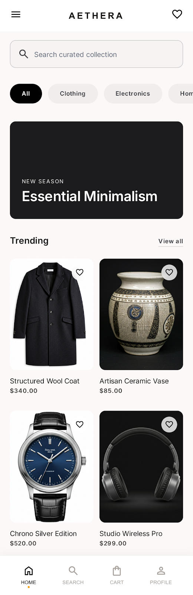
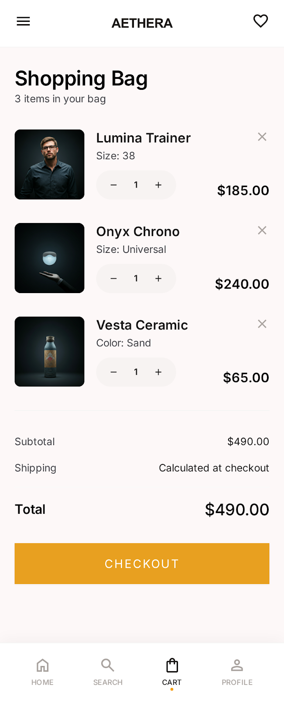
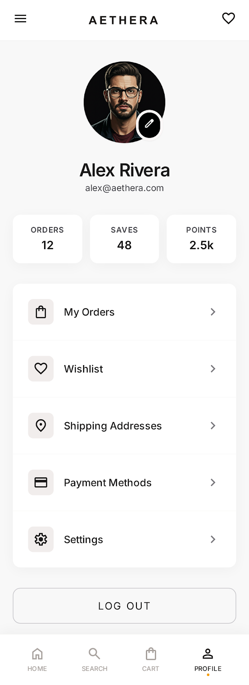

# Aethera — Premium E-Commerce Experience

Aethera is a modern, high-performance customer-facing Android application built with a focus on rich aesthetics and a robust, scalable architecture. It serves as the companion app to AetheraAdmin, offering a seamless shopping experience powered by Firebase and the latest Jetpack Compose technologies.

---

## 🎨 Visual Identity (Stitch Indigo)

Aethera follows the **Stitch Indigo** design system, utilizing Material 3 to create a premium, high-contrast, and intuitive user interface.

| Home Screen | Product Detail | Shopping Bag | Profile |
| :---: | :---: | :---: | :---: |
|  |  |  |  |

---

## 🛠 Tech Stack & Tools

- **UI Framework:** [Jetpack Compose](https://developer.android.com/jetpack/compose) with Material 3.
- **Architecture:** MVVM + Clean Architecture (Feature-based partitioning).
- **Dependency Injection:** [Koin 4.0](https://insert-koin.io/) — A pragmatic, lightweight DI framework.
- **Navigation:** [Navigation 3](https://developer.android.com/guide/navigation/navigation-3) — Utilizing type-safe `@Serializable` routes and polymorphic navigation graphs.
- **Backend:** [Firebase](https://firebase.google.com/) (Firestore for real-time data, Auth for user management, Storage for media).
- **Image Loading:** [Coil 3](https://coil-kt.github.io/coil/) — Modern image loading powered by Coroutines.
- **Serialization:** [Kotlinx Serialization](https://github.com/Kotlin/kotlinx.serialization) for type-safe routing.
- **Concurrency:** Kotlin Coroutines & StateFlow.

---

## 🏗 Holistic Architecture

The project is structured following **Clean Architecture** principles to ensure strict separation of concerns and maximum testability.

### 1. Domain Layer (Pure Kotlin)
Contains the core business logic, entities, and repository interfaces. It is independent of any Android or Firebase dependencies.
- **Models:** `Product`, `Category`, `CartItem`, `Order`, `User`.
- **Repositories:** Defined as interfaces to allow for easy mocking and swapping of data sources.

### 2. Data Layer
The implementation of the domain repository interfaces.
- **Firestore Integration:** Uses `snapshotListener` for real-time UI updates. When an admin changes a price or adds stock, the user sees it instantly.
- **Koin Modules:** The `AppModule.kt` manages all singleton repository bindings and ViewModel factory injections.

### 3. Presentation Layer (Compose)
A reactive UI layer driven by `StateFlow`.
- **ViewModel:** Each screen has a dedicated ViewModel that manages UI state via a single `uiState` flow.
- **Navigation 3:** Implements a polymorphic `AetheraNavGraph` that handles complex deep-linking and state preservation using a custom `SavedStateConfiguration`.
- **Parent/Content Pattern:** Every screen is split into a **Parent Composable** (handles DI and logic) and a **Content Composable** (purely UI), ensuring screens are previewable and loosely coupled.

---

## 🚀 Key Features

- **Real-time Sync:** Real-time updates for products and categories directly from Firestore.
- **Smart Cart Management:** Automated sub-collection management for user carts with optimistic UI updates.
- **Type-Safe Navigation:** No more string-based routes; everything is handled via `@Serializable` data classes.
- **Secure Checkout:** Lightweight checkout process writing directly to a centralized `ORDERS` collection for admin fulfillment.
- **Wishlist & Search:** Instant client-side search filtering and persistent wishlist tracking.

---

## 📁 Project Structure

```text
app/
├── common/             # Constants and ResultState wrappers
├── data/
│   ├── di/             # Koin Modules
│   └── repository/     # Firestore Implementations
├── domain/
│   ├── models/         # Business Entities
│   └── repository/     # Interface Definitions
├── presentation/       # Feature-based UI (Home, Cart, Product, etc.)
│   ├── navigation/     # NavGraph and Nav3 Setup
│   └── theme/          # Stitch Design Tokens (M3)
└── BaseApplication     # Koin Initialization
```

---

## 🤝 Developed By
**Tarun Sharma** — [GitHub](https://github.com/Tarun-sharma05)